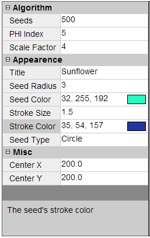

# Dart Property Grid

The property grid control enables the user to modify the properties for an object

Each entry in the property grid is a `PropertyItem` grouped under various categories.  The values for each item are displayed in `views`.  Clicking a view will bring up an `editor` to modify it's value.  

To modify the properties of an object, a property model object needs to be defined

Start by importing the project as mentioned in the pub

Create a property model object for your class / data structure

	var model = new PropertyGridModel();
	
Register property items in the model with the `register()` function

	void register(String name, PropertyItemGetter getter, PropertyItemSetter setter,
		  String viewType, String editorType, {var editorConfig, String category, String description}) 

Define a `name` for the property item, it's `getter` / `setter`.  the `getter` function will be called by the property grid to query the value and display it in the property grid.  This value is displayed in the "view" of the type `viewType`.  Clicking this view would bring up the editor of type `editorType` where the user can modify the contents of the property item.   The editor would invoke the `setter` to set the updated value

Optional `category` and `description` can be provided to display extra information about the item on the property grid.  The `editorConfig` is based on the `editorType`.

`viewType` can have the following values:

 - label
 - color
 
`editorType` can have the following values:

 - textbox
 - slider
 - spinner
 - color

The possible `editorConfig` for each `editorType` is:

 - **textbox**: N/A
 - **spinner**: A getter function that returns a List<String> for populating the spinner
 - **color**: A integer value specifying the size of the color picker (e.g. 128)
 - **slider**: `[minValue, maxValue, factor=1]`,  The first `minValue` parameter is the minimum value of the slider, followed by the `maxValue` maximum value parameter.  An optional third `factor` parameter can be passed in that divides the value in the slider. E.g. `[1104, 2722, 100]` would create a slider with the range of `(11.04, 27.22)`.  An input of `[10, 50]` would create a slider of range `10 to 50`

 
## Property Views

 - **Label View**: Display simple textual values 
 - **Color View**: Display a color value and its preview 

## Property Editors

 - **Textbox Editor**: Replaces the view with a textbox and lets the user edit it's contents 
 
 
 
 - **Color Editor**: Display a configurable color picker control 
 
 

 - **Spinner**: Display a drop down list
 
 

 - **Slider**: Display a slider to edit numeric values
 
 

## Demo
View the live demo [here](#)